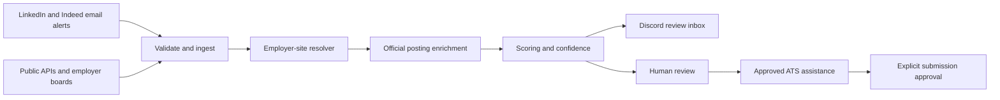

# Jobbot Architecture

## Current and Target Flow

The resolver, enrichment, Scoring V2, dashboard, and ATS assistance nodes are V1
work in progress. Discovery, ingestion, current scoring, Discord, persistence,
scheduling, and application approval records are operational.

## Trust Boundaries

- LinkedIn and Indeed are discovery and email-notification providers only.
- Jobbot does not automate or scrape LinkedIn or Indeed pages.
- Official APIs and employer ATS endpoints are preferred over browser rendering.
- Read-only Playwright is permitted only after an official employer destination
  is known and allowed by that site's rules.
- Application automation remains behind start and submit approvals.
- Credentials, job history, labels, backups, and metrics remain local and private.

## Persistence

TinyDB is the V1 single-user store. Every database carries a schema version.
Migrations create an owner-only snapshot before writing, and the scheduler creates
one retained daily backup. SQLite is the planned V2 persistence boundary before
multi-process or multi-user operation.

Backup SHA-256 sidecars detect accidental corruption. They are not authenticated
and do not defend against a malicious local user who can rewrite both files; V1's
security boundary is the operating-system account and owner-only file permissions.

## Quality Gates

Every major milestone requires focused tests, the full automated suite,
independent review, adversarial QA, a real local preflight, and production health
verification before commit and push.
