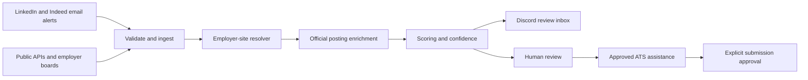

# Jobbot Architecture

## Current and Target Flow

The deterministic resolver is operational for captured official links, exact
employer-board matches, and manual handoff. Static enrichment is operational for
captured official payloads, Greenhouse and Lever APIs, and matching employer-page
`JobPosting` JSON-LD. Read-only rendering of JavaScript-only pages, Scoring V2,
the dashboard, and ATS assistance remain V1 work in progress. Discovery,
ingestion, current scoring, Discord, persistence, scheduling, and application
approval records are operational.

The resolver retains every incoming URL as provenance. LinkedIn, Indeed, and
aggregator URLs remain discovery links; only validated public HTTPS employer/ATS
links become application URLs. Automatic matching requires one unambiguous exact
company/title match with a compatible location.

Enrichment runs only after resolution. API and static-page responses have bounded
sizes, static requests pin TLS connections to a validated public address at each
redirect, and parsed posting identity must match the stored job. Successful
enrichment preserves the method and source URL, updates posting details, and
reruns deterministic scoring. Transient requests are deferred for retry;
terminal payload errors require manual review, and pages without unique static
posting data are routed to the future dynamic-page stage.

## Trust Boundaries

- LinkedIn and Indeed are discovery and email-notification providers only.
- Jobbot does not automate or scrape LinkedIn or Indeed pages.
- Official APIs and employer ATS endpoints are preferred over browser rendering.
- Read-only Playwright is permitted only after an official employer destination
  is known and allowed by that site's rules.
- Application automation remains behind start and submit approvals.
- Credentials, job history, labels, backups, and metrics remain local and private.

## Persistence

TinyDB is the V1 single-user store. Every database carries a schema version.
Migrations create an owner-only snapshot before writing, and the scheduler creates
one retained daily backup. SQLite is the planned V2 persistence boundary before
multi-process or multi-user operation.

Schema v3 retains each source's posting snapshot alongside canonical jobs and URL
provenance. This allows richer official-board data to update a job first found in
an email without losing where either record came from.

Backup SHA-256 sidecars detect accidental corruption. They are not authenticated
and do not defend against a malicious local user who can rewrite both files; V1's
security boundary is the operating-system account and owner-only file permissions.

## Quality Gates

Every major milestone requires focused tests, the full automated suite,
independent review, adversarial QA, a real local preflight, and production health
verification before commit and push.
