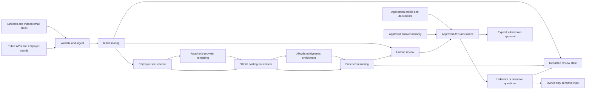

# Jobbot Architecture

## Current and Target Flow

The resolver is operational for captured official links, exact employer-board
matches, bounded Adzuna/Remotive/Himalayas destination extraction, and manual
handoff. Enrichment is operational for captured official payloads, Greenhouse
and Lever APIs, and matching employer-page `JobPosting` JSON-LD. Approved
JavaScript-dependent fallbacks use bounded read-only Playwright rendering.
Scoring V2, the dashboard, and ATS assistance remain V1 work in progress.

The resolver retains every incoming URL as provenance. LinkedIn, Indeed, and
aggregator URLs remain discovery links; only validated public HTTPS employer/ATS
links become application URLs. Automatic matching requires one unambiguous exact
company/title match with a compatible location. Approved aggregator resolution
uses source-specific exact apply-link labels or validated redirects, round-robin
batching, public-DNS checks, pinned HTTPS, and cooldowns. LinkedIn and Indeed are
never requested.

Enrichment runs only after resolution. API and static-page responses have bounded
sizes, static requests pin TLS connections to a validated public address at each
redirect, and parsed posting identity must match the stored job. Successful
enrichment preserves the method and source URL, updates posting details, and
reruns deterministic scoring. Transient requests are deferred for retry;
terminal payload errors require manual review, and pages without unique static
posting data are routed to the approved dynamic-page stage.

Dynamic rendering uses a fresh non-persistent Chromium context and never clicks,
types, authenticates, or submits. Only same-host GET document/script/XHR/fetch
requests are allowed; the validated hostname is pinned to a public address and
all other resource classes and browser communication APIs are blocked. Provider
resolution is limited to the D016 sources. Employer enrichment requires an
explicit domain allowlist entry and a rendered posting identity match.

## Application Memory

Application memory is planned but not yet operational. It will be separate from
job-scoring preferences and will contain a validated personal application
profile, approved document catalog, and structured answer library. Answers retain
their original wording, normalized intent, sensitivity, context, approval,
reuse policy, and revision history. Unknown or sensitive questions pause the
workflow. Discord carries review state, but raw sensitive values are entered
only through an owner-only local surface; chat history alone is never treated as
an approved answer source.

## Trust Boundaries

- LinkedIn and Indeed are discovery and email-notification providers only.
- Jobbot does not automate or scrape LinkedIn or Indeed pages.
- Official APIs and employer ATS endpoints are preferred over browser rendering.
- Read-only Playwright is permitted only for D016 provider resolution or after an
  official employer destination is known and explicitly allowlisted.
- Application automation remains behind start and submit approvals.
- Credentials, job history, labels, backups, and metrics remain local and private.

## Persistence

TinyDB is the V1 single-user store. Local Jobbot entry points serialize access
through cross-process locking and atomic file replacement. Every database carries
a schema version. Migrations create an owner-only snapshot before writing, and
the scheduler creates one retained daily backup. SQLite is required before
multi-user, hosted, or materially higher-concurrency operation. A local dashboard
must use the existing application/storage boundary rather than become an
independent uncoordinated database writer.

Schema v3 retains each source's posting snapshot alongside canonical jobs and URL
provenance. This allows richer official-board data to update a job first found in
an email without losing where either record came from. Schema v4 adds provider
resolution attempt counts, timestamps, cooldowns, and sanitized outcome types.
Schema v5 adds separate dynamic-resolution attempts and cooldowns.

Backup SHA-256 sidecars detect accidental corruption. They are not authenticated
and do not defend against a malicious local user who can rewrite both files; V1's
security boundary is the operating-system account and owner-only file permissions.

## Quality Gates

Before review, every major milestone requires focused tests, the full automated
suite, and a safe local preflight. The change is committed to a scoped branch,
pushed to a draft pull request, and must pass GitHub CI before independent code
review and adversarial QA. After approval and merge to `develop`, production
deployment and health verification close the milestone. Until the scheduler has
an isolated release checkout, runtime development requires stopping the
LaunchAgent before edits and restarting it only after merge and passing CI.

Material decisions and changes to these boundaries are retained in the
[decision register](DECISIONS.md).
